# Learning Management System (LMS)

## Overview

Welcome to mini Learning Management System (LMS)! This platform is designed to streamline the process of managing and delivering educational content. Whether you are an educator, student, this LMS offers a range of features to enhance the learning experience.

### Codebase
-**Frontend:**
 (https://github.com/042Vidhi/Mini_lms_frontend)
-**Backend:**
[url](https://github.com/042Vidhi/Mini_lms_backend)

## Technologies Used

### Frontend

- **React.js:** The user interface is developed using React.js, providing a responsive and interactive experience for users.
  
- **Redux Toolkit:** State management is handled by Redux, used in course management and user authentication.
  
- **Tailwind CSS:** Tailwind CSS is used for styling, ensuring a clean and consistent design across the application.

- **React Router:** React Router is used for routing, allowing for dynamic routing and navigation.

- **Material UI:** Material UI is used for styling, ensuring a clean and consistent design across the application.

### Backend

- **Django:** The backend is powered by Django, a high-level Python web framework known for its simplicity and reliability.

- **Django Rest Framework (DRF):** DRF is utilized to build a robust RESTful API, allowing seamless communication between the frontend and backend.

- **SQLite:** As a default, lightweight database for development.

### Authentication and Authorization

- **Firebase Authentication:** Firebase Authentication is used for secure user authentication, providing a scalable and reliable solution.

## Features

### 1. User Roles

Our LMS supports different user roles, including:

- **Instructor:** Instructors can create and manage courses
  
- **Student:** Students can enroll in courses, access learning materials, Star courses 

### 2. Course Management

- **Create Courses:** Instructors can easily create and customize courses, including adding lecture pdf, vidoes and multimedia content.

- **Enrollment:** Students can enroll in any course and access the course materials.

### 3. Planner 

- **Planner:** Students can plan their study schedule by adding tasks and events to the planner.

### 4. Shorts

- **Shorts:** Students can view short educational videos.

### 5. #3d Learning

- **3d Learning:** Added a threejs model to the course page.

## Screenshots

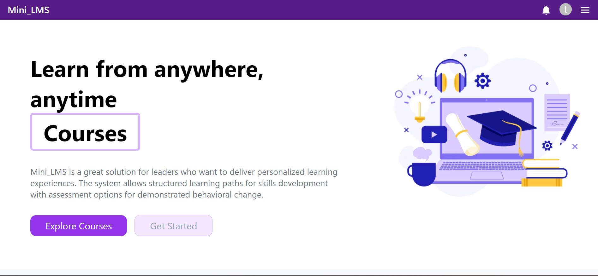

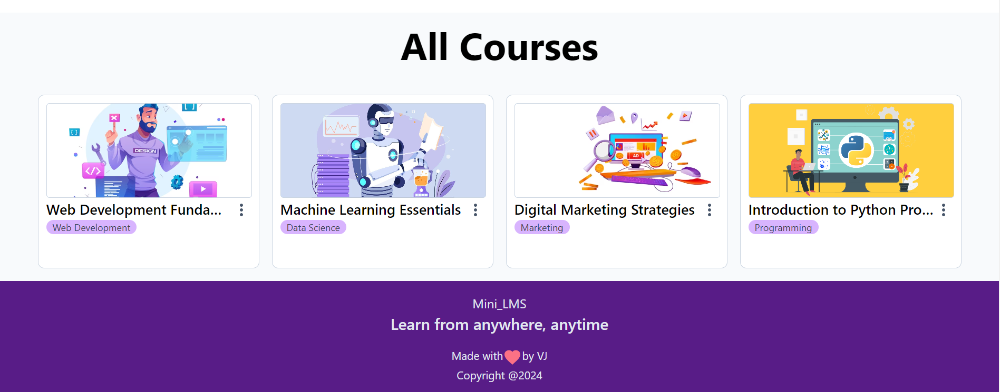

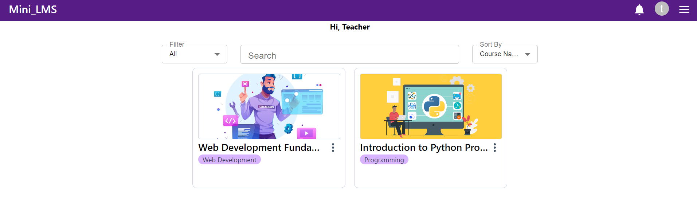

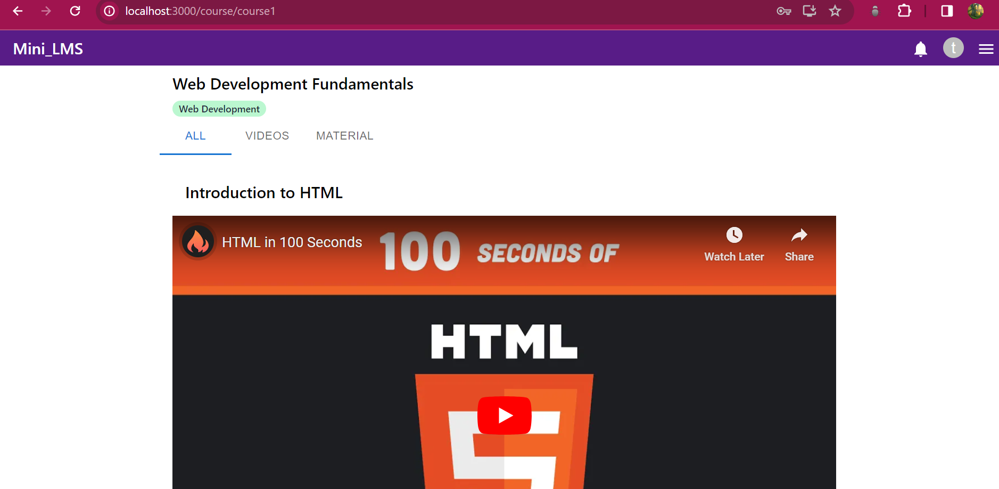

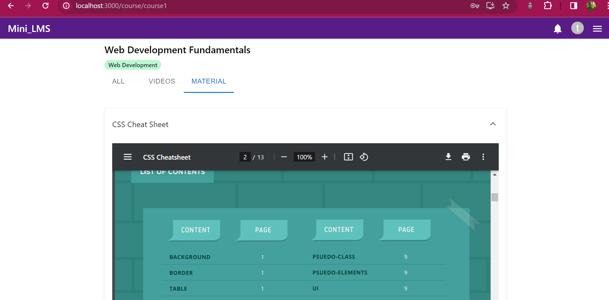

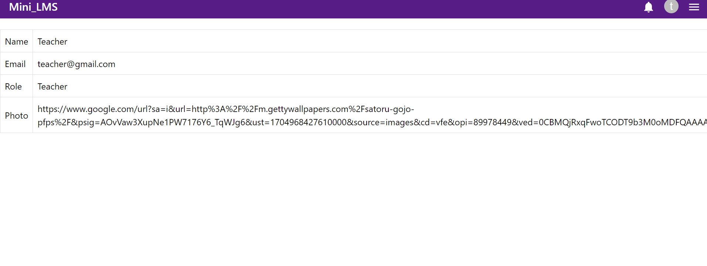

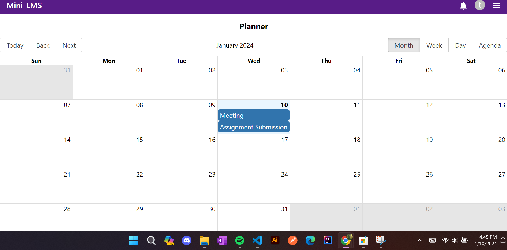

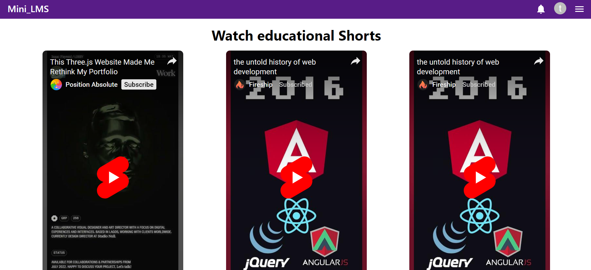

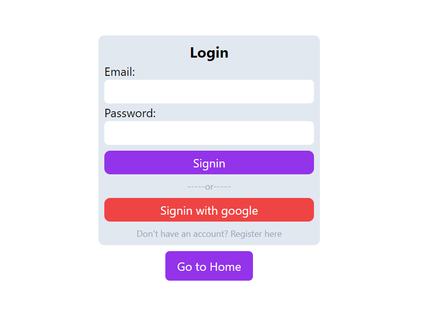

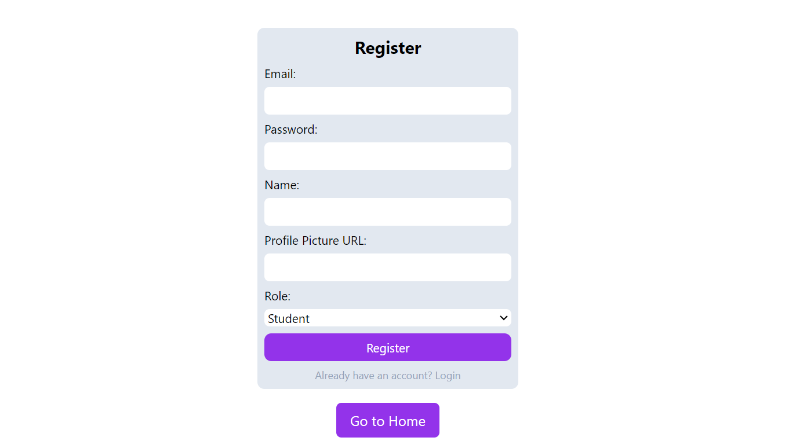

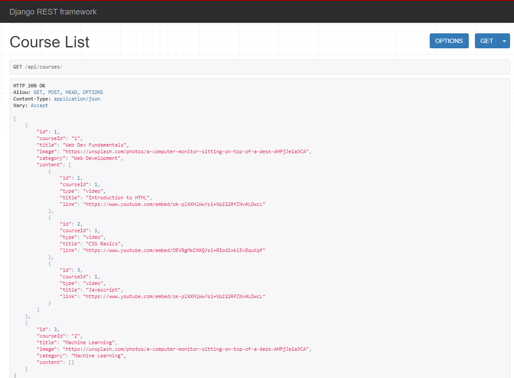
*Fig: Course Creation API*

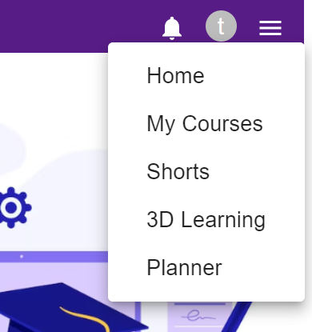

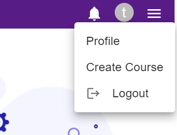

